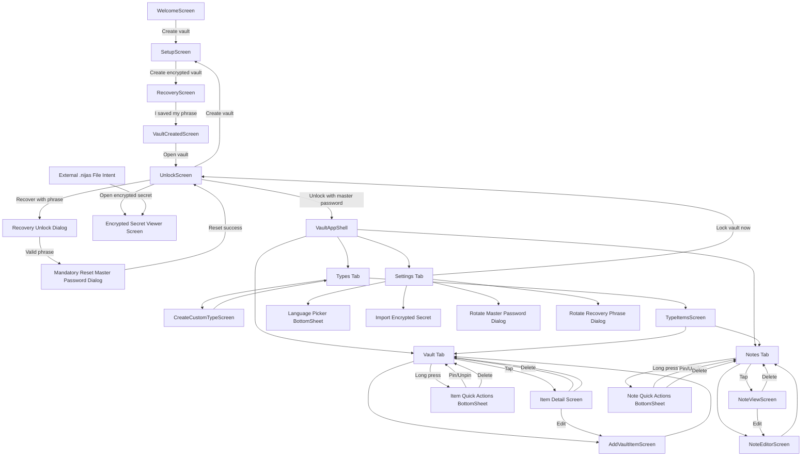

# Screen & Flow Graph

This document is the source of truth for UI navigation, screen responsibilities, and feature coverage.

## 1) Graph (Navigation Map)

## 2) Screen Catalog

### Onboarding
- `WelcomeScreen`
  - Features: marketing hero, create vault CTA.
  - Next: `SetupScreen`.

- `SetupScreen`
  - Features: guardian profile selection, master password + confirm password.
  - Validation: password and confirm must match.
  - Next: `RecoveryScreen`.

- `RecoveryScreen`
  - Features: shows 12-word phrase with numbering, copy phrase, warnings.
  - Next: `VaultCreatedScreen`.

- `VaultCreatedScreen`
  - Features: created confirmation, open vault CTA.
  - Next: `UnlockScreen`.

- `UnlockScreen`
  - Features: unlock by password, recover with phrase dialog path, optional biometric CTA, create-vault shortcut, open encrypted-secret action.
  - Next: `VaultAppShell` on unlock success.

- `Encrypted Secret Viewer Screen`
  - Features: key-value rendering, per-field copy, sensitive-value hide/show (eye toggle), copy full visible secret.

- `Recovery Unlock Dialog`
  - Features: phrase entry and validation.
  - Next: mandatory reset dialog.

- `Mandatory Reset Master Password Dialog`
  - Features: enforced password reset after recovery unlock.
  - Next: returns to `UnlockScreen`; user must log in again.

### App Shell
- `VaultAppShell`
  - Features: bottom nav (`Vault`, `Notes`, `Types`, `Settings`), FAB on vault/notes.

- `Vault Tab`
  - Features: visible active vault name in header, search items, sort selector (`Last accessed`, `Title`), recent items list, Gmail-style multi-select mode (enter via left icon tap, selected-count top bar with pin/delete).
  - Navigation: item detail, add item, item quick-actions bottom sheet via long press.

- `Item Detail Screen`
  - Features: reveal sensitive value, copy value, edit action, delete action.

- `AddVaultItemScreen`
  - Features: built-in item templates + custom type support, field forms, save.

- `Notes Tab`
  - Features: search notes, pinned filter, sort selector (`Last accessed`, `Title`), notes list, tag chips, add note, inline info icon near title (opens info dialog), long-press quick actions (pin/unpin/delete/share), Gmail-style multi-select mode (enter via left avatar tap, selected-count top bar with pin/delete).
  - Navigation: note view, note editor, note quick-actions bottom sheet via long press.

- `NoteViewScreen`
  - Features: read note, edit CTA, delete action.

- `NoteEditorScreen`
  - Features: compact writing-first layout, clean app-bar title, second-row toggle controls (`Title & tags`, `Formatting`), collapsible detail/format panels, rich text editor, save.

- `Types Tab`
  - Features: custom types list, counts by type, create custom type.
  - Navigation: type items list.

- `CreateCustomTypeScreen`
  - Features: type name, dynamic field rows, value type chooser, save.

- `TypeItemsScreen`
  - Features: items/notes list by selected type.
  - Navigation: note view or item detail based on type.

- `Settings Tab`
  - Features: language picker, visible active vault name, biometric slider switch (enable/disable confirmations), rotate master password, import encrypted secret, default sort for keys/notes, single export-vault button, lock now.
  - Export flow: prompts for desired output file name before writing vault file.

- `Language Picker BottomSheet`
  - Features: choose `System`, `English`, `Español`.

- `Rotate Master Password Dialog`
  - Features: current + new + confirm, executes wrapper rotation.

- `Rotate Recovery Phrase Dialog`
  - Features: current + new + confirm phrase, executes recovery wrapper rotation.

## 3) Coverage Checklist (E2E)

- Onboarding create flow.
- Unlock flow.
- Unlock screen shortcuts (`Create vault`, `Open encrypted secret`).
- Recovery unlock path + mandatory reset path.
- Vault tab detail + add item.
- Notes add/view/edit with tags.
- Types create custom type + type items view.
- Settings language, biometric slider switch, master rotation, export action, lock now.
- Settings encrypted-secret import action.
- Vault/Notes long-press quick actions (pin/unpin/delete) and detail-screen delete actions.
- Vault/Notes multi-select mode (left-icon entry, selected-count top bar, bulk pin/delete).
