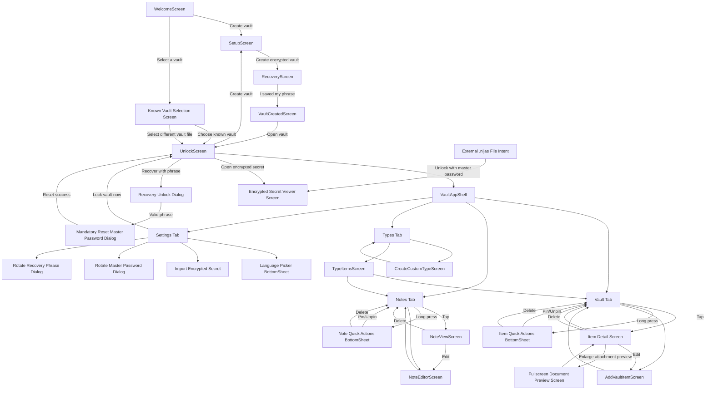

# Screen & Flow Graph

This document is the source of truth for UI navigation, screen responsibilities, and feature coverage.

## 1) Graph (Navigation Map)

```mermaid
flowchart TD
  A[WelcomeScreen] -->|Create vault| B[SetupScreen]
  A -->|Select a vault| A1[Known Vault Selection Screen]
  A1 -->|Choose known vault| E[UnlockScreen]
  A1 -->|Select different vault file| E
  B -->|Create encrypted vault| C[RecoveryScreen]
  C -->|I saved my phrase| D[VaultCreatedScreen]
  D -->|Open vault| E[UnlockScreen]
  E -->|Unlock with master password| F[VaultAppShell]
  E -->|Create vault| B
  E -->|Open encrypted secret| E2[Encrypted Secret Viewer Screen]
  X[External .nijas File Intent] --> E2
  E -->|Recover with phrase| G[Recovery Unlock Dialog]
  G -->|Valid phrase| H[Mandatory Reset Master Password Dialog]
  H -->|Reset success| E

  F --> F1[Vault Tab]
  F --> F2[Notes Tab]
  F --> F3[Types Tab]
  F --> F4[Settings Tab]

  F1 -->|Tap| I[Item Detail Screen]
  F1 -->|Long press| I2[Item Quick Actions BottomSheet]
  I2 -->|Pin/Unpin| F1
  I2 -->|Delete| F1
  F1 --> J[AddVaultItemScreen]
  J --> F1
  I -->|Edit| J
  I -->|Delete| F1
  I -->|Enlarge attachment preview| I3[Fullscreen Document Preview Screen]
  I3 --> I
  I --> F1

  F2 -->|Tap| K[NoteViewScreen]
  F2 -->|Long press| K2[Note Quick Actions BottomSheet]
  K2 -->|Pin/Unpin| F2
  K2 -->|Delete| F2
  F2 --> L[NoteEditorScreen]
  L --> F2
  K -->|Edit| L
  K -->|Delete| F2

  F3 --> M[CreateCustomTypeScreen]
  F3 --> N[TypeItemsScreen]
  M --> F3
  N --> F1
  N --> F2

  F4 --> O[Language Picker BottomSheet]
  F4 --> S[Import Encrypted Secret]
  F4 --> P[Rotate Master Password Dialog]
  F4 --> Q[Rotate Recovery Phrase Dialog]
  F4 -->|Lock vault now| E
```

## 2) Screen Catalog

### Onboarding
- `WelcomeScreen`
  - Features: Nija header/theme control, local-first hero, grouped vault-entry actions, and cloud restore.
  - Layout: one mobile-first full-viewport surface across all breakpoints with a centered `460px` entry column; there is no separate wide marketing layout or outer phone-frame crop.
  - Actions: `Select a vault` opens known vaults only; `Open vault file` and `Import data` use direct local import; `Create a vault` starts setup; cloud restore uses the supported existing cloud flow.
  - Next: `SetupScreen`.

- `Known Vault Selection Screen`
  - Features: full-page list of saved local vault references, their non-sensitive source/location hint when available, their last-opened date when available, and a direct `Select different vault file` action.
  - Layout: mobile-first route with a compact top bar and the `nija-e2e-product-flow.html` compact entry-shell scale: centered `460px` content, compact heading rhythm, and 86px vault rows. It is not presented as a dialog or bottom sheet.
  - Entry: `Select a vault`, wide dashboard `Switch vault`, and locking the active vault. The current/just-locked vault is always available for selection even when the local-reference cache is unavailable.
  - Next: selecting a known vault goes directly to one normal `UnlockScreen`; selecting a different file opens the existing vault-file import flow.

- `SetupScreen`
  - Features: guardian profile selection, master password + confirm password.
  - Validation: password and confirm must match.
  - Next: `RecoveryScreen`.

- `RecoveryScreen`
  - Features: shows 12-word phrase with numbering, copy phrase, warnings.
  - Next: `VaultCreatedScreen`.

- `VaultCreatedScreen`
  - Features: created confirmation, open vault CTA.
  - Next: `UnlockScreen`.

- `UnlockScreen`
  - Features: unlock by password, optional app PIN CTA, recover with phrase dialog path, optional biometric CTA, create-vault shortcut, open encrypted-secret action.
  - Web/wide layout: app-themed Nija unlock surface scaled for tablet/web, preserving recovery/open/create actions.
  - Web quick-unlock behavior: after a successful master-password login, app PIN can be enrolled for local quick unlock. Secure WebAuthn PRF device unlock can be enrolled when supported after PIN setup; biometric unlock recovers the PIN and then uses the PIN helper.
  - Imported-vault validation uses this same normal unlock presentation and `Unlock` action; no separate imported-vault login surface is shown.
  - Next: `VaultAppShell` on unlock success.

- `Encrypted Secret Viewer Screen`
  - Features: key-value rendering, per-field copy, sensitive-value hide/show (eye toggle), copy full visible secret.

- `Recovery Unlock Dialog`
  - Features: phrase entry and validation.
  - Next: mandatory reset dialog.

- `Mandatory Reset Master Password Dialog`
  - Features: enforced password reset after recovery unlock.
  - Next: returns to `UnlockScreen`; user must log in again.

### App Shell
- `VaultAppShell`
  - Features: bottom nav (`Vault`, `Notes`, `Types`, `Settings`), FAB on vault/notes.
  - Web/tablet expanded layout: from `760px` wide with at least `700px` vertical room, or tablet/foldable portrait screens with at least `600px` shortest side and `700px` usable height, a narrow brand/status rail plus vault navigation sidebar (`Home`, `All items`, `Favorites`, `Settings`) frames constrained content; phones and short windows keep bottom navigation.
  - Wide vault picker opens as a centered dialog; mobile vault picker remains a bottom sheet.
  - Imported or already-known vaults opened with a password enter the app directly after validation instead of returning to a second unlock screen.

- `Vault Tab`
  - Features: visible active vault name in header, search items by title/subtitle/type/folder/tags/note text/field values, sort selector (`Last accessed`, `Title`), recent items list, Gmail-style multi-select mode (enter via left icon tap, selected-count top bar with pin/delete).
  - Web/tablet layout: dashboard uses a constrained search row, six stat cards (`Total Items`, `Folders`, `Logins`, `Notes`, `Identities`, `Documents`), recent items, `Add item`/`Import data`/`Switch vault` quick actions, and category summaries without stretched empty space.
  - Empty new-vault homepage: shows real vault content plus an optional `View demo preview` CTA; sample login, note, identity, card, and document records appear only on the homepage dashboard after the user opts in, and `Exit demo` returns to the real vault view. All Items and Favorites always show the real vault lists.
  - Mobile layout: keeps Nija brand header, search, 2-column category grid, extra category tiles for custom types, and compact recent items. Categories with zero saved entries are hidden.
  - Dashboard search routes to All Items with category/type/filter state reset so previous tile selections do not hide matching records.
  - Navigation: item detail, add item, item quick-actions bottom sheet via long press.

- `All Items View`
  - Mobile: compact list rows, horizontal filter chips, and the existing selection action bar.
  - Tablet/web: bounded index with name, type, folder, modified date, and contextual row actions; filters open in a centered dialog.

- `AddVaultItemScreen`
  - Mobile: stacked, touch-first editor form.
  - Tablet/web: the same form behavior in a centered, readable-width panel; New Item category selection is bounded to a readable column, and saved confirmation remains a dialog on wide screens.

- `Item Detail Screen`
  - Features: reveal sensitive value, copy value, edit action, delete action, attachment preview with fullscreen/enlarge action.
  - Web/tablet layout: centered constrained detail surface with a main field panel and side metadata/quick-actions panel; medium/mobile collapses to one column.
  - Field display: empty fields and duplicate title fields are hidden; primary quick action is selected from item type.

- `AddVaultItemScreen`
  - Features: built-in item templates + custom type support, field forms, save.
  - Web/tablet saved confirmation: centered constrained dialog; mobile saved confirmation remains a bottom sheet.

- `Fullscreen Document Preview Screen`
  - Features: enlarged image/text/PDF preview, PDF pan/zoom, text scrolling, close/minimize action.
  - Opened from: document detail preview and item attachment preview.

- `Notes Tab`
  - Features: search notes, pinned filter, sort selector (`Last accessed`, `Title`), notes list, tag chips, add note, inline info icon near title (opens info dialog), long-press quick actions (pin/unpin/delete/share), Gmail-style multi-select mode (enter via left avatar tap, selected-count top bar with pin/delete).
  - Navigation: note view, note editor, note quick-actions bottom sheet via long press.

- `NoteViewScreen`
  - Features: read note, edit CTA, delete action.

- `NoteEditorScreen`
  - Features: compact writing-first layout, clean app-bar title, second-row toggle controls (`Title & tags`, `Formatting`), collapsible detail/format panels, rich text editor, save.

- `Types Tab`
  - Features: custom types list, counts by type, create custom type.
  - Web/tablet layout: custom template management uses the same constrained Nija header and panel surfaces as other editor routes.
  - Navigation: type items list.

- `CreateCustomTypeScreen`
  - Features: type name, dynamic field rows, value type chooser, save.
  - Layout: constrained Nija-themed editor panels on web/tablet; mobile remains a stacked editor flow without stretched form controls.

- `TypeItemsScreen`
  - Features: items/notes list by selected type.
  - Navigation: note view or item detail based on type.

- `Settings Tab`
  - Features: language picker, visible active vault name, app PIN setup/change row, biometric slider switch (enable/disable confirmations), secure WebAuthn PRF device-unlock enrollment on web with unsupported-browser guidance, rotate master password, import encrypted secret, default sort for keys/notes, single export-vault button, lock now.
  - Export flow: prompts for desired output file name before writing vault file.

- `Language Picker BottomSheet`
  - Features: choose `System`, `English`, `Español`.

- `Rotate Master Password Dialog`
  - Features: current + new + confirm, executes wrapper rotation.

- `Rotate Recovery Phrase Dialog`
  - Features: current + new + confirm phrase, executes recovery wrapper rotation.

## 3) Coverage Checklist (E2E)

- Onboarding create flow.
- Known-vault selection page -> unlock flow, including the direct alternate vault-file action.
- Unlock flow.
- Unlock screen shortcuts (`Create vault`, `Open encrypted secret`).
- Recovery unlock path + mandatory reset path.
- Vault tab detail + add item.
- Notes add/view/edit with tags.
- Types create custom type + type items view.
- Settings language, biometric slider switch, master rotation, export action, lock now.
- Settings encrypted-secret import action.
- Vault/Notes long-press quick actions (pin/unpin/delete) and detail-screen delete actions.
- Vault/Notes multi-select mode (left-icon entry, selected-count top bar, bulk pin/delete).
